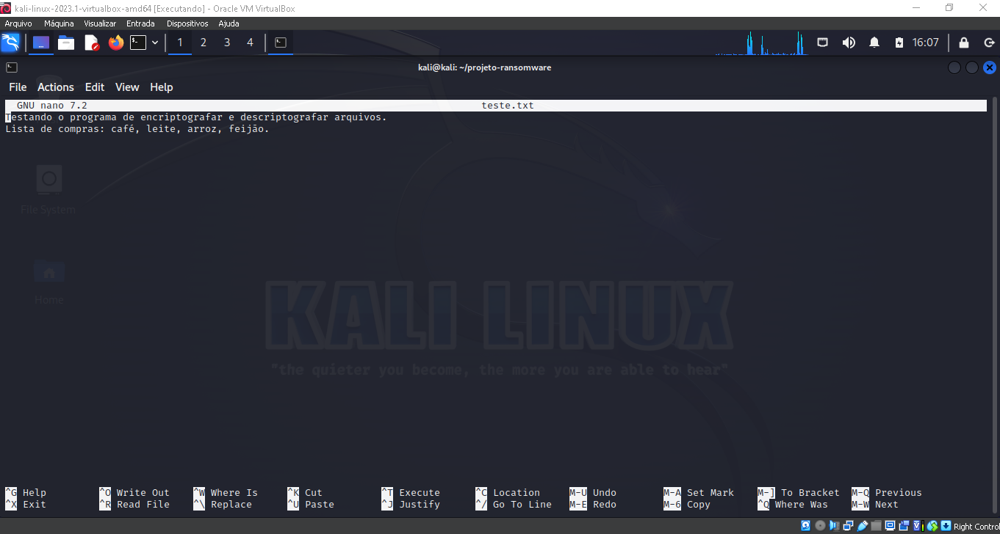
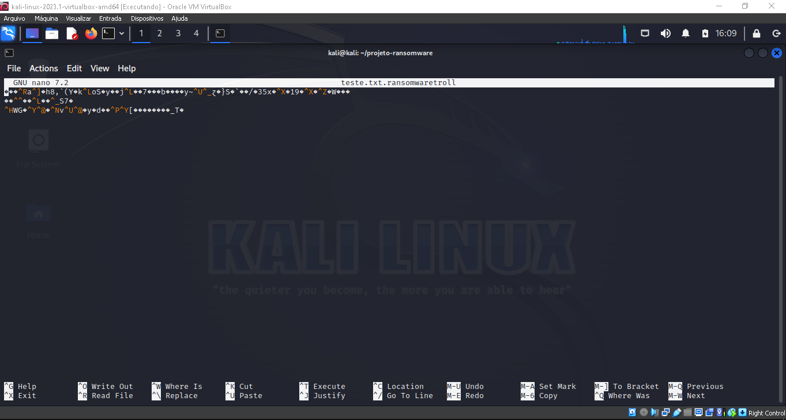
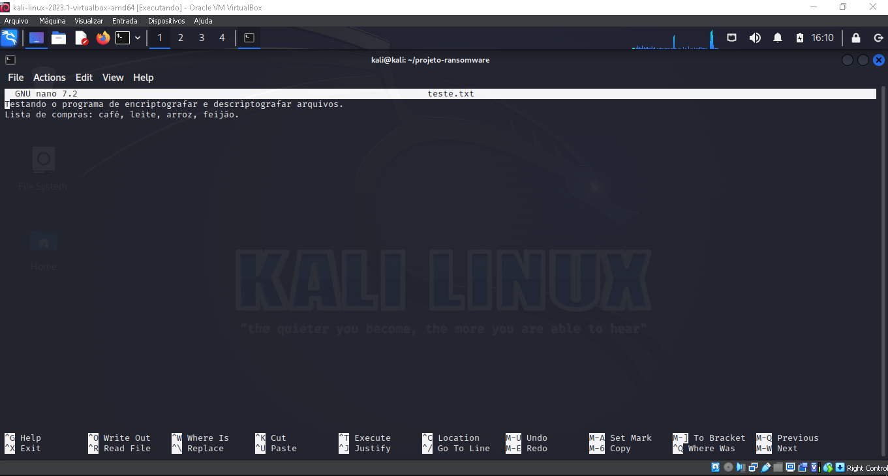
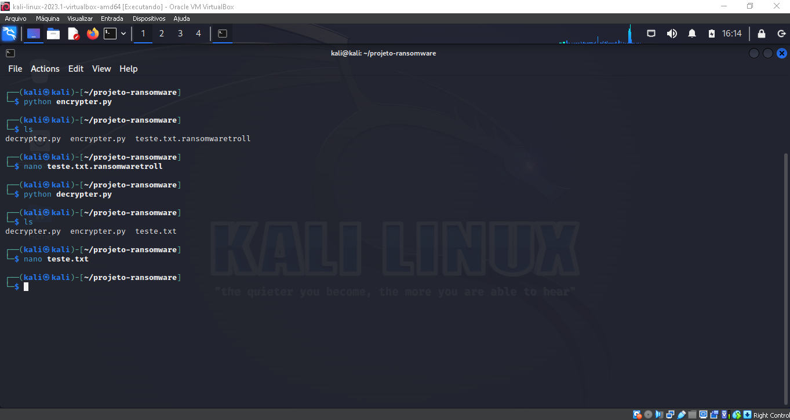

# Cybersecurity-Ransomware

### DESCRIÇÃO
Neste desafio de projeto da (DIO) Digital Innovation One na formação cybersecurity specialist, foi implementado um Ransomware para criptografar e descriptografar arquivos utilizando:

- linguagens: Python, Shell script.
- Sistema operacional: Windows.
- Máquina virtual: Kali Linux.
- Interpretador de comando: Bash.

# Resutados

### Arquivo original

### Arquivo encriptografado

### Arquivo descriptografado

### Comandos digitados

# Observação: 
- Criptografar: OK
- Descriptografar: OK
